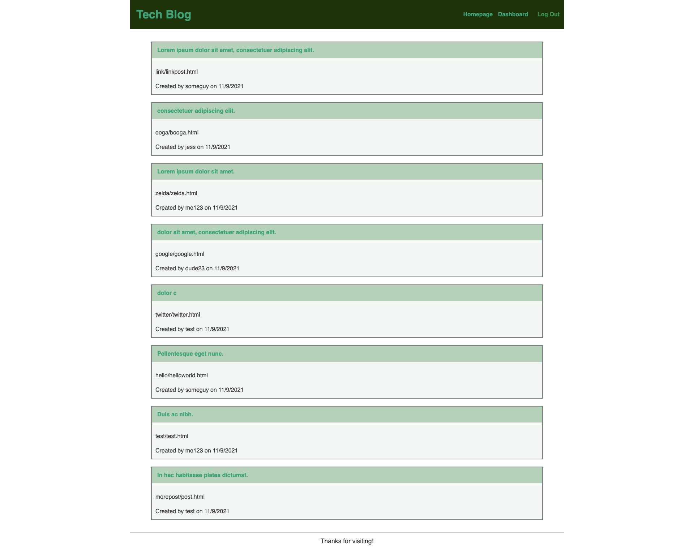

# Tech Blog

This is a CMS-style blog where developers can post and comment on other users' post, for all their technical needs. 

### Preview



## Installation

You do need to have Node.js and MySQL database installed on your computer.

In root directory enter: 
```bash
  npm i
```
To add the database to MySQL:
```bash
  mysql -u root -p
    (enter your MySQL password)
  source db/schema.sql
  show databases;
    (to make sure it worked)
  use blog_db
  quit
```
Add your seeds:
```bash
  npm run seed
```
To start server type: 
```bash
  npm start
```
## Packages Used
* MySQL2
Preferred for Sequelize; successor for mysql
```bash
  npm i --save mysql2
```
* Sequelize
Used to connect your Express.js API to a MySQL database 
```bash
  npm i sequelize
```
* Dotenv
This will store your MySQL username, password, and database name
```bash
  npm i dotenv
```
* Handlebars
Template engine
```bash
  npm i express-handlebars
```
* Bcrypt
Will help hash passwords in your database
```bash
  npm i dotenv
```
* Express-Session
This command will help set up your session middleware and connect it to mysql
```bash
  npm i express-session connect-session-sequelize
```
## Deployment 

Used with Heroku, make sure you add JAWSDB onto your application

## Demo

* **[Live Site](https://murmuring-brushlands-99941.herokuapp.com/)**

## Questions

Contact me at **[GitHub profile](https://github.com/jessangarcia)** for any questions, or reach out to my email <jessenia.garcia@outlook.com>
I have other repositories you can view on my GitHub if you would like to contribute to those.